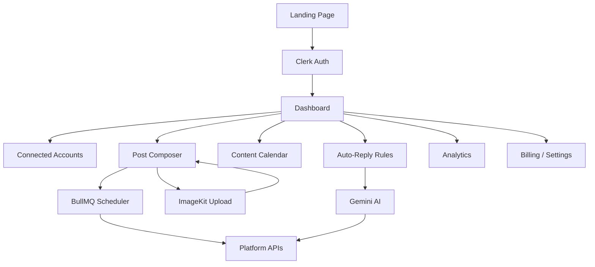
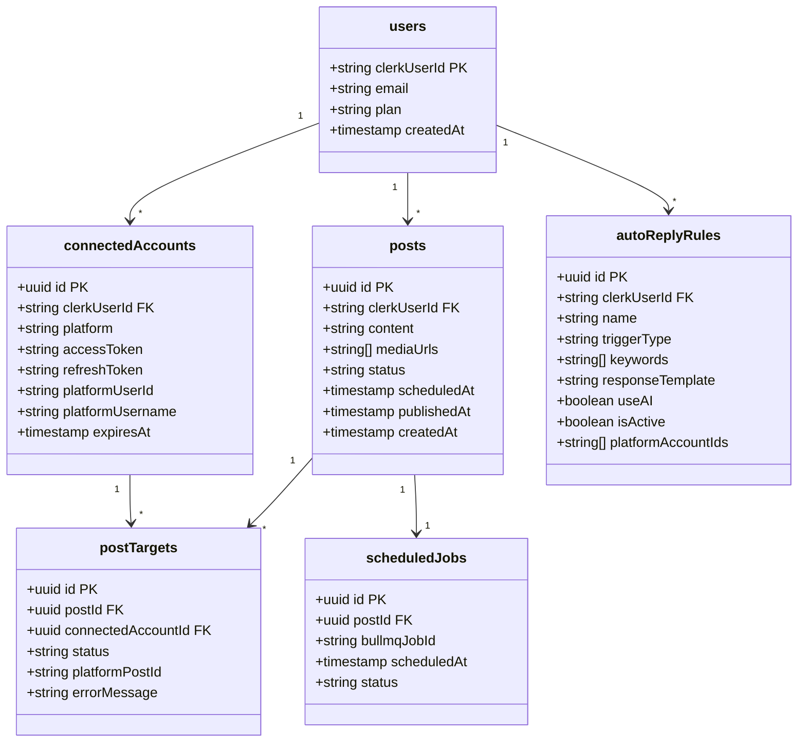

# ⚡ Social Copilot

<div align="center">

[](https://nextjs.org/)
[](https://www.typescriptlang.org/)
[](https://tailwindcss.com/)
[](https://orm.drizzle.team/)
[](https://clerk.com/)
[](https://neon.tech/)
[](https://bullmq.io/)
[](https://deepmind.google/technologies/gemini/)

A premium, Dribbble-quality, multi-platform social media management SaaS. Create, schedule, and publish posts across Instagram, YouTube, TikTok, Facebook, LinkedIn, Pinterest, Discord, X (Twitter), and Slack simultaneously. Features an AI-powered composer, visual content calendar, auto-reply rules, and billing system.

[Explore Specification](./Social_Copilot_%E2%80%94_Master_Product_Specification.md) · [Report Bug](https://github.com/tomnguyen103/social-media-scheduler/issues) · [Request Feature](https://github.com/tomnguyen103/social-media-scheduler/issues)

</div>

---

## 📖 Overview

Social Copilot is a complete social media management hub. Write once and publish or schedule posts across all connected networks. Elevate engagement with AI-powered auto-replies, organize campaigns on a visual content calendar, and scale operations through Clerk Billing subscription tiers.

## 🛠️ Tech Stack

| Layer | Technology | Description |
|---|---|---|
| **Framework** | Next.js 15+ (App Router) | React framework for frontend and serverless routes. |
| **Language** | TypeScript | Strong typing for clean, maintainable logic. |
| **Styling & UI** | ShadCN + Tailwind CSS v4 | Harmonious, fast, modern, and interactive components. |
| **Authentication** | Clerk Auth | Single sign-on, OAuth accounts, and profile management. |
| **Billing** | Clerk Billing | Tiered subscription gates (Free, Pro, Agency). |
| **Database** | NeonDB (PostgreSQL) | Fully serverless cloud relational database. |
| **ORM** | Drizzle ORM | TypeScript-first ORM for type-safe schema and migration management. |
| **Storage & AI CDN** | ImageKit | Cloud image/video hosting and real-time asset optimization. |
| **Background Jobs** | BullMQ (Redis-backed) | Queue management for posting, polling comments, and auto-replies. |
| **AI Model** | Google Gemini AI | Dynamic generation of post captions, hashtags, and auto-replies. |

---

## 🗺️ Application Architecture

The block diagram below maps the interaction between client components, OAuth endpoints, backend routes, workers, and databases:



---

## 📈 Supported Social Platforms

| Platform | Post | Schedule | Auto-Reply | Description / Details |
|---|:---:|:---:|:---:|---|
| **Instagram** | ✅ | ✅ | ✅ | Uses Facebook Graph API with page linked accounts |
| **YouTube** | ✅ | ✅ | ✅ | Supports video uploads and comment moderation |
| **TikTok** | ✅ | ✅ | ✅ | Video posts, scheduled publishing, and comment sync |
| **Facebook** | ✅ | ✅ | ✅ | Publishes to user feed, groups, or pages |
| **LinkedIn** | ✅ | ✅ | ✅ | Profile or Organization page post updates |
| **Pinterest** | ✅ | ✅ | ❌ | Board pin scheduling with rich descriptions |
| **Discord** | ✅ | ✅ | ✅ | Webhook-driven bot messages and channel threads |
| **Twitter / X** | ✅ | ✅ | ✅ | Single/thread text posts with image attachments |
| **Slack** | ✅ | ✅ | ✅ | Workspace channel announcements and threads |

---

## 📁 File Structure

The project directory structure follows Next.js App Router conventions and clean division of concerns:

```
social-media-scheduler/
├── app/
│   ├── (landing)/           # Public landing and marketing screens
│   ├── (auth)/              # Clerk sign-in and sign-up pages
│   ├── (dashboard)/         # Main SaaS dashboard layouts and pages
│   │   ├── dashboard/       # Dashboard base view & widgets
│   │   ├── accounts/        # Connected account management
│   │   ├── composer/        # AI-powered post composer
│   │   ├── calendar/        # Content calendar interface
│   │   ├── auto-reply/      # Auto-reply rule configurator
│   │   ├── analytics/       # Engagement charts and metrics
│   │   ├── billing/         # Subscriptions portal
│   │   └── settings/        # Account & organization preferences
│   ├── api/
│   │   ├── accounts/        # CRUD for OAuth tokens
│   │   ├── ai/              # Caption and hashtag generation
│   │   ├── analytics/       # Post engagement endpoints
│   │   ├── auto-reply/      # Comment response triggers
│   │   ├── media/           # ImageKit signature generation
│   │   ├── oauth/           # OAuth redirect endpoints
│   │   ├── posts/           # Creating/scheduling posts
│   │   └── webhooks/        # Clerk & third-party webhook handlers
│   ├── robots.ts
│   └── sitemap.ts
├── components/
│   ├── analytics/           # Recharts dashboards
│   ├── auto-reply/          # Reply rules builder
│   ├── calendar/            # Monthly, weekly, and list views
│   ├── composer/            # Post composer client & preview cards
│   ├── dashboard/           # Sidebar, Topbar, and shell layouts
│   ├── landing/             # Marketing sections (hero, testimonials)
│   └── ui/                  # Shadcn custom component suite
├── hooks/                   # Reusable React hooks
├── lib/
│   ├── db/                  # Drizzle database client & schema definitions
│   ├── gemini/              # Gemini SDK client setup
│   ├── imagekit/            # ImageKit media upload configurations
│   ├── platforms/           # Modular social network posting clients
│   └── bullmq/              # Redis queue definitions & connection pooling
├── workers/                 # Node.js worker scripts for publisher, poller & auto-reply
├── package.json             # App dependencies & run scripts
└── tsconfig.json            # TypeScript specifications
```

---

## 🗄️ Database Schema

The relations in our Neon Database are modeled through Drizzle ORM:



- **`users`**: Manages current billing plans and identity syncs.
- **`connectedAccounts`**: OAuth tokens linked to active social profiles.
- **`posts`**: Core post details, content body, and scheduled timestamps.
- **`postTargets`**: Tracks status (pending, success, error) and response IDs of individual networks for a single post.
- **`autoReplyRules`**: Define keyword rules and AI generation prompts for specific platforms.
- **`scheduledJobs`**: Reference to BullMQ jobs running in Redis.

---

## ⏰ Background Jobs (BullMQ Queues)

BullMQ runs Redis-backed queues to offload heavy operations from serverless API routes:

| Queue | Job Name | Frequency / Trigger | Description |
|---|---|---|---|
| **`post-publisher`** | `publishPost` | Triggered at scheduled post date | Dispatches media/caption payload to platform clients. |
| **`token-refresh`** | `refreshToken` | Recurring hourly cron job | Renews expiring OAuth tokens before they expire. |
| **`comment-poller`** | `pollComments` | Every 5-15 mins per platform | Fetch latest posts comments to pass through reply filters. |
| **`auto-reply`** | `sendAutoReply` | Fired when comment meets criteria | Generates and sends a template or Gemini-backed reply. |

---

## 🚀 Getting Started

Follow these steps to run Social Copilot locally:

### Prerequisites

- **Node.js** (v20+ recommended)
- **Redis** (local instance or serverless Upstash Redis url)
- **PostgreSQL** (Neon database or standard Postgres instance)

### 1. Installation

Clone this repository and install the dependencies:

```bash
git clone https://github.com/tomnguyen103/social-media-scheduler.git
cd social-media-scheduler
npm install
```

### 2. Environment Configuration

Create a `.env.local` file in the root directory:

```bash
cp .env.example .env.local
```

Fill in the credentials:
- **Clerk**: Publishable key, secret key, webhook secret for user signups/auth.
- **NeonDB / Postgres**: Connection string (`DATABASE_URL`).
- **ImageKit**: API Keys and Endpoint URL.
- **Redis URL**: Full Redis credentials (`REDIS_URL`) for BullMQ.
- **Gemini**: API API key (`GEMINI_API_KEY`) and default model.
- **OAuth Clients**: App credentials for Facebook/Instagram, YouTube, LinkedIn, X, Slack, Pinterest, TikTok, Discord.

### 3. Run Database Migrations

Generate and run Drizzle migrations to set up your tables:

```bash
npm run db:generate
npm run db:push
```

### 4. Run the Dev Servers

Start the Next.js frontend development server:

```bash
npm run dev
```

In a separate terminal, run the BullMQ worker processor to handle background scheduling, publisher dispatch, and auto-replies:

```bash
npm run workers
```

Open [http://localhost:3000](http://localhost:3000) to view the application.
