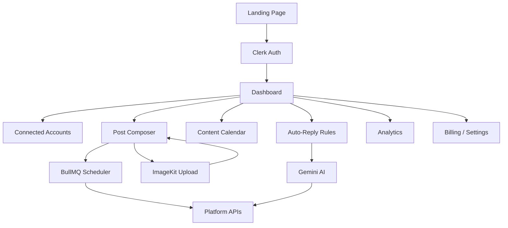
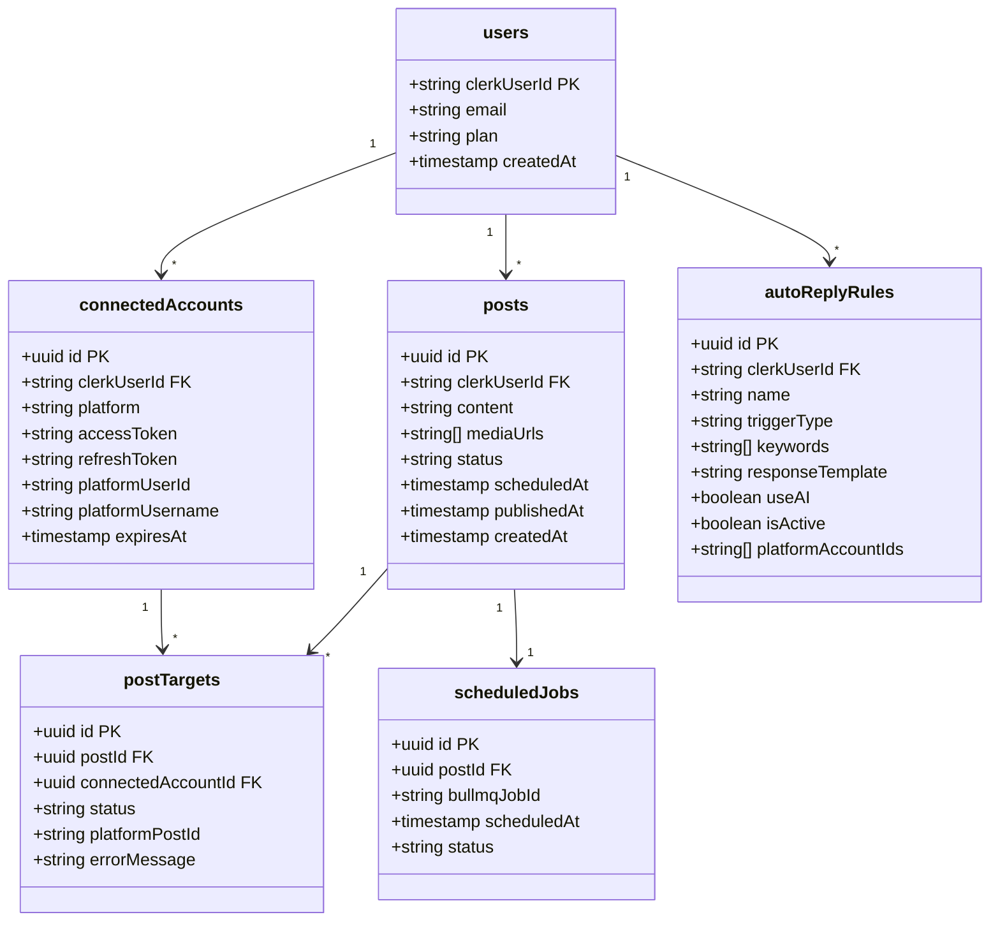

I want to build social-copilot app where user can connect to there social media platform like Instagram, Youtube, Tiktok, Facebook, Linkdin, Pintrest, Disocrd, Twitter, slack etc and then on this platform user can create new post and just select different platform where he want to post same on different platform and then option to create post / upload media etc and can schedule that post on certain time. Then on calender user can see all scheduled post. Also option to add auto comment reply option based on centrain keywords or based on comment on post so all of this feature need to cover in this app. Paid plan / billing features with Premium plan.
Also Add Landing Screen as well. Make sure the UIUX is professional like Dribble Template.
TechStack:
NextJs 16, Typescript, ShadCn Component Library
Clerk For Auth, Clerk Billing for Subscription Model, NeonDB with DrizzleORM, ImageKit for File STorage and ai tranformation,
Use BullMq for Background Job
Gemini AI for AI model to use in app

# Social Copilot — Master Product Specification

## Overview

Social Copilot is a professional multi-platform social media management SaaS. Users connect their social accounts, compose posts once, and publish or schedule them across multiple platforms simultaneously. AI-powered auto-reply, a visual content calendar, media management via ImageKit, and a Clerk-powered billing system round out the product.

## Tech Stack

| Layer | Technology |
| --- | --- |
| Framework | Next.js 16 (App Router) |
| Language | TypeScript |
| UI Components | ShadCN + Tailwind CSS v4 |
| Auth & Billing | Clerk (Auth + Clerk Billing) |
| Database | NeonDB (PostgreSQL) via DrizzleORM |
| File Storage & AI Transform | ImageKit |
| Background Jobs | BullMQ (Redis-backed) |
| AI Model | Google Gemini AI |
| Deployment | Vercel (recommended) |

## Supported Social Platforms

| Platform | Post | Schedule | Auto-Reply |
| --- | --- | --- | --- |
| Instagram | ✅ | ✅ | ✅ |
| YouTube | ✅ | ✅ | ✅ |
| TikTok | ✅ | ✅ | ✅ |
| Facebook | ✅ | ✅ | ✅ |
| LinkedIn | ✅ | ✅ | ✅ |
| Pinterest | ✅ | ✅ | ❌ |
| Discord | ✅ | ✅ | ✅ |
| Twitter / X | ✅ | ✅ | ✅ |
| Slack | ✅ | ✅ | ✅ |

## Application Architecture



## Feature Modules

### 1. Landing Page

A Dribbble-quality marketing page with:

- Hero section with animated gradient headline, CTA buttons (Get Started Free / Watch Demo)
- Platform logos marquee strip
- Feature highlights (3-column grid with icons)
- Pricing section (Free / Pro / Agency tiers)
- Testimonials carousel
- FAQ accordion
- Footer with links

### 2. Authentication (Clerk)

- Sign Up / Sign In via Clerk's hosted UI embedded in the app
- OAuth social login (Google, GitHub)
- Protected routes via Clerk middleware
- User profile management via Clerk's `<UserProfile />` component

### 3. Connected Accounts

Users connect social platforms via OAuth. Each connection stores:

- `platform` (enum)
- `accessToken` / `refreshToken` (encrypted)
- `platformUserId`
- `platformUsername`
- `expiresAt`
- `scopes`

OAuth flows are handled server-side via Next.js Route Handlers.

### 4. Post Composer

The core creation experience:

- Rich text editor with character counter per platform
- Platform selector (multi-select checkboxes with platform icons)
- Media uploader (images/videos via ImageKit — drag & drop)
- AI caption generator (Gemini) — "Generate Caption" button
- AI hashtag suggester (Gemini)
- Platform-specific preview panel (renders how the post looks on each selected platform)
- Publish Now vs. Schedule toggle
- Date/time picker for scheduling (timezone-aware)

### 5. Content Calendar

- Full-month calendar view (react-day-picker or custom)
- Each day shows post thumbnails/chips
- Click a post chip → side panel with post details, status, edit/delete actions
- Filter by platform, status (draft / scheduled / published / failed)
- Week view and list view toggle

### 6. Auto-Reply Rules

- Rule builder UI: trigger type (keyword match / any comment / first comment)
- Keyword list input
- Response template (static text or AI-generated via Gemini)
- Platform scope (which connected accounts the rule applies to)
- Enable/disable toggle per rule
- BullMQ worker polls for new comments and fires matching rules

### 7. Analytics Dashboard

- Overview cards: total posts, reach, engagement rate, scheduled upcoming
- Per-platform breakdown chart (recharts)
- Top performing posts table
- Date range filter

### 8. Billing & Subscription (Clerk Billing)

| Plan | Price | Limits |
| --- | --- | --- |
| Free | $0/mo | 3 connected accounts, 10 posts/mo, no AI |
| Pro | $19/mo | 10 connected accounts, unlimited posts, AI features |
| Agency | $49/mo | Unlimited accounts, unlimited posts, AI + priority support |

- Clerk Billing manages plan state; plan is read from Clerk session claims
- Feature gates enforced server-side in API routes and client-side in UI
- Upgrade prompt modals when limits are hit

### 9. Settings

- Profile (Clerk `<UserProfile />`)
- Connected Accounts management
- Notification preferences
- Danger zone (delete account)

## Database Schema (DrizzleORM / NeonDB)



## Background Jobs (BullMQ)

| Queue | Job | Description |
| --- | --- | --- |
| `post-publisher` | `publishPost` | Publishes a post to all target platforms at scheduled time |
| `token-refresh` | `refreshToken` | Refreshes expiring OAuth tokens |
| `comment-poller` | `pollComments` | Polls platform APIs for new comments |
| `auto-reply` | `sendAutoReply` | Sends AI or template reply to matched comments |

BullMQ workers run as a separate Node.js process (or Vercel background function). Redis is required (Upstash Redis recommended for serverless).

## File Structure (Target)

```
app/
  (landing)/           # Public marketing pages
  (auth)/              # Clerk sign-in/sign-up
  (dashboard)/
    layout.tsx         # Sidebar + top nav shell
    page.tsx           # Analytics overview
    accounts/          # Connected accounts
    composer/          # Post composer
    calendar/          # Content calendar
    auto-reply/        # Auto-reply rules
    settings/          # Settings
    billing/           # Billing portal
  api/
    oauth/[platform]/  # OAuth callback handlers
    posts/             # Post CRUD
    schedule/          # Schedule management
    webhooks/          # Platform webhooks
    billing/           # Clerk billing webhooks
components/
  landing/             # Landing page sections
  dashboard/           # Dashboard shell components
  composer/            # Post composer components
  calendar/            # Calendar components
  auto-reply/          # Auto-reply rule components
  analytics/           # Chart components
lib/
  db/                  # DrizzleORM schema + client
  platforms/           # Per-platform API clients
  imagekit/            # ImageKit client
  gemini/              # Gemini AI client
  bullmq/              # Queue definitions + workers
  billing/             # Clerk billing helpers
workers/
  publisher.ts         # BullMQ worker process
  comment-poller.ts
```

## UI/UX Design Principles

- **Design language**: Clean, modern SaaS — dark sidebar, white content area, subtle shadows
- **Color palette**: Deep indigo primary, slate neutrals, emerald success, rose error
- **Typography**: Inter font, clear hierarchy
- **Animations**: Subtle fade/slide transitions via Tailwind + tw-animate-css
- **Responsive**: Mobile-first, collapsible sidebar on mobile
- **Empty states**: Illustrated empty states for all list views
- **Loading states**: Skeleton loaders on all data-fetching components

## Wireframes

### Landing Page

```wireframe

<html>
<head>
<style>
* { margin: 0; padding: 0; box-sizing: border-box; font-family: Inter, sans-serif; }
body { background: #0a0a0f; color: #fff; }
nav { display: flex; justify-content: space-between; align-items: center; padding: 20px 60px; border-bottom: 1px solid #1e1e2e; }
.logo { font-size: 20px; font-weight: 700; color: #818cf8; }
.nav-links { display: flex; gap: 32px; font-size: 14px; color: #94a3b8; }
.nav-cta { display: flex; gap: 12px; }
.btn-outline { padding: 8px 20px; border: 1px solid #334155; border-radius: 8px; font-size: 14px; color: #cbd5e1; background: transparent; cursor: pointer; }
.btn-primary { padding: 8px 20px; border-radius: 8px; font-size: 14px; background: #6366f1; color: #fff; border: none; cursor: pointer; }
.hero { text-align: center; padding: 100px 60px 60px; }
.hero-badge { display: inline-block; padding: 6px 16px; background: #1e1b4b; border: 1px solid #4338ca; border-radius: 999px; font-size: 12px; color: #a5b4fc; margin-bottom: 24px; }
.hero h1 { font-size: 64px; font-weight: 800; line-height: 1.1; margin-bottom: 24px; background: linear-gradient(135deg, #fff 40%, #818cf8); -webkit-background-clip: text; -webkit-text-fill-color: transparent; }
.hero p { font-size: 18px; color: #94a3b8; max-width: 560px; margin: 0 auto 40px; line-height: 1.7; }
.hero-btns { display: flex; gap: 16px; justify-content: center; }
.btn-hero { padding: 14px 32px; border-radius: 10px; font-size: 16px; font-weight: 600; cursor: pointer; }
.btn-hero-primary { background: #6366f1; color: #fff; border: none; }
.btn-hero-secondary { background: transparent; color: #cbd5e1; border: 1px solid #334155; }
.platforms { display: flex; gap: 24px; justify-content: center; align-items: center; padding: 40px 60px; border-top: 1px solid #1e1e2e; border-bottom: 1px solid #1e1e2e; }
.platform-chip { padding: 8px 20px; background: #111827; border: 1px solid #1f2937; border-radius: 999px; font-size: 13px; color: #6b7280; }
.features { padding: 80px 60px; }
.features h2 { text-align: center; font-size: 40px; font-weight: 700; margin-bottom: 60px; }
.features-grid { display: grid; grid-template-columns: repeat(3, 1fr); gap: 24px; }
.feature-card { background: #111827; border: 1px solid #1f2937; border-radius: 16px; padding: 32px; }
.feature-icon { width: 44px; height: 44px; background: #1e1b4b; border-radius: 10px; margin-bottom: 16px; display: flex; align-items: center; justify-content: center; font-size: 20px; }
.feature-card h3 { font-size: 18px; font-weight: 600; margin-bottom: 10px; }
.feature-card p { font-size: 14px; color: #6b7280; line-height: 1.6; }
.pricing { padding: 80px 60px; background: #050508; }
.pricing h2 { text-align: center; font-size: 40px; font-weight: 700; margin-bottom: 60px; }
.pricing-grid { display: grid; grid-template-columns: repeat(3, 1fr); gap: 24px; max-width: 900px; margin: 0 auto; }
.pricing-card { background: #111827; border: 1px solid #1f2937; border-radius: 16px; padding: 32px; }
.pricing-card.featured { border-color: #6366f1; background: #1e1b4b; }
.price { font-size: 40px; font-weight: 800; margin: 16px 0 8px; }
.price span { font-size: 16px; font-weight: 400; color: #6b7280; }
.pricing-card ul { list-style: none; margin: 24px 0; display: flex; flex-direction: column; gap: 10px; }
.pricing-card li { font-size: 14px; color: #94a3b8; }
.pricing-card li::before { content: "✓ "; color: #6366f1; }
footer { padding: 40px 60px; border-top: 1px solid #1e1e2e; display: flex; justify-content: space-between; align-items: center; }
.footer-logo { font-size: 18px; font-weight: 700; color: #818cf8; }
.footer-links { display: flex; gap: 24px; font-size: 13px; color: #6b7280; }
</style>
</head>
<body>
<nav>
  <div class="logo">⚡ SocialCopilot</div>
  <div class="nav-links">
    <span>Features</span><span>Pricing</span><span>Blog</span><span>Docs</span>
  </div>
  <div class="nav-cta">
    <button class="btn-outline">Sign In</button>
    <button class="btn-primary">Get Started Free</button>
  </div>
</nav>

<div class="hero">
  <div class="hero-badge">🚀 Now supporting 9 platforms</div>
  <h1>Manage All Your Social<br/>Media in One Place</h1>
  <p>Create, schedule, and publish content across Instagram, YouTube, TikTok, LinkedIn and more — powered by AI.</p>
  <div class="hero-btns">
    <button class="btn-hero btn-hero-primary" data-element-id="hero-cta-primary">Start for Free</button>
    <button class="btn-hero btn-hero-secondary" data-element-id="hero-cta-secondary">Watch Demo →</button>
  </div>
</div>

<div class="platforms">
  <div class="platform-chip">📸 Instagram</div>
  <div class="platform-chip">▶️ YouTube</div>
  <div class="platform-chip">🎵 TikTok</div>
  <div class="platform-chip">👔 LinkedIn</div>
  <div class="platform-chip">🐦 Twitter/X</div>
  <div class="platform-chip">📌 Pinterest</div>
  <div class="platform-chip">💬 Discord</div>
  <div class="platform-chip">💼 Slack</div>
  <div class="platform-chip">📘 Facebook</div>
</div>

<div class="features">
  <h2>Everything you need to grow</h2>
  <div class="features-grid">
    <div class="feature-card">
      <div class="feature-icon">✍️</div>
      <h3>AI-Powered Composer</h3>
      <p>Generate captions, hashtags, and platform-optimized content with Gemini AI in one click.</p>
    </div>
    <div class="feature-card">
      <div class="feature-icon">📅</div>
      <h3>Visual Content Calendar</h3>
      <p>See all your scheduled posts in a beautiful calendar. Drag, drop, and reschedule with ease.</p>
    </div>
    <div class="feature-card">
      <div class="feature-icon">🤖</div>
      <h3>Auto-Reply Rules</h3>
      <p>Set keyword triggers and let AI respond to comments automatically — 24/7 engagement.</p>
    </div>
    <div class="feature-card">
      <div class="feature-icon">📊</div>
      <h3>Analytics Dashboard</h3>
      <p>Track reach, engagement, and growth across all platforms from a single dashboard.</p>
    </div>
    <div class="feature-card">
      <div class="feature-icon">🖼️</div>
      <h3>Media Management</h3>
      <p>Upload, transform, and optimize images and videos with ImageKit's powerful CDN.</p>
    </div>
    <div class="feature-card">
      <div class="feature-icon">⚡</div>
      <h3>Multi-Platform Publishing</h3>
      <p>Write once, publish everywhere. Select your platforms and hit publish — it's that simple.</p>
    </div>
  </div>
</div>

<div class="pricing">
  <h2>Simple, transparent pricing</h2>
  <div class="pricing-grid">
    <div class="pricing-card">
      <div style="font-size:14px;color:#6b7280;font-weight:600;">FREE</div>
      <div class="price">$0<span>/mo</span></div>
      <ul>
        <li>3 connected accounts</li>
        <li>10 posts per month</li>
        <li>Basic scheduling</li>
        <li>Content calendar</li>
      </ul>
      <button class="btn-outline" style="width:100%;">Get Started</button>
    </div>
    <div class="pricing-card featured">
      <div style="font-size:14px;color:#a5b4fc;font-weight:600;">PRO ⭐</div>
      <div class="price">$19<span>/mo</span></div>
      <ul>
        <li>10 connected accounts</li>
        <li>Unlimited posts</li>
        <li>AI caption & hashtags</li>
        <li>Auto-reply rules</li>
        <li>Analytics dashboard</li>
      </ul>
      <button class="btn-primary" style="width:100%;padding:12px;">Upgrade to Pro</button>
    </div>
    <div class="pricing-card">
      <div style="font-size:14px;color:#6b7280;font-weight:600;">AGENCY</div>
      <div class="price">$49<span>/mo</span></div>
      <ul>
        <li>Unlimited accounts</li>
        <li>Unlimited posts</li>
        <li>All AI features</li>
        <li>Priority support</li>
        <li>Team collaboration</li>
      </ul>
      <button class="btn-outline" style="width:100%;">Contact Sales</button>
    </div>
  </div>
</div>

<footer>
  <div class="footer-logo">⚡ SocialCopilot</div>
  <div class="footer-links">
    <span>Privacy</span><span>Terms</span><span>Support</span><span>Status</span>
  </div>
</footer>
</body>
</html>
```

### Dashboard Shell

```wireframe

<html>
<head>
<style>
* { margin: 0; padding: 0; box-sizing: border-box; font-family: Inter, sans-serif; }
body { display: flex; height: 100vh; background: #f8fafc; color: #0f172a; }
.sidebar { width: 240px; background: #0f172a; display: flex; flex-direction: column; padding: 20px 0; flex-shrink: 0; }
.sidebar-logo { padding: 0 20px 24px; font-size: 18px; font-weight: 700; color: #818cf8; border-bottom: 1px solid #1e293b; }
.sidebar-nav { padding: 16px 12px; display: flex; flex-direction: column; gap: 4px; flex: 1; }
.nav-item { display: flex; align-items: center; gap: 12px; padding: 10px 12px; border-radius: 8px; font-size: 14px; color: #94a3b8; cursor: pointer; }
.nav-item.active { background: #1e1b4b; color: #a5b4fc; }
.nav-item:hover { background: #1e293b; color: #e2e8f0; }
.nav-icon { width: 18px; text-align: center; }
.sidebar-bottom { padding: 16px 12px; border-top: 1px solid #1e293b; }
.user-chip { display: flex; align-items: center; gap: 10px; padding: 10px 12px; border-radius: 8px; }
.avatar { width: 32px; height: 32px; border-radius: 50%; background: #6366f1; display: flex; align-items: center; justify-content: center; font-size: 13px; color: #fff; font-weight: 600; }
.user-info { font-size: 13px; }
.user-name { color: #e2e8f0; font-weight: 500; }
.user-plan { color: #6b7280; font-size: 11px; }
.main { flex: 1; display: flex; flex-direction: column; overflow: hidden; }
.topbar { height: 60px; background: #fff; border-bottom: 1px solid #e2e8f0; display: flex; align-items: center; justify-content: space-between; padding: 0 28px; }
.topbar-title { font-size: 18px; font-weight: 600; }
.topbar-actions { display: flex; gap: 12px; align-items: center; }
.btn-compose { padding: 8px 20px; background: #6366f1; color: #fff; border: none; border-radius: 8px; font-size: 14px; font-weight: 500; cursor: pointer; }
.content { flex: 1; overflow-y: auto; padding: 28px; }
.stats-grid { display: grid; grid-template-columns: repeat(4, 1fr); gap: 16px; margin-bottom: 28px; }
.stat-card { background: #fff; border: 1px solid #e2e8f0; border-radius: 12px; padding: 20px; }
.stat-label { font-size: 12px; color: #94a3b8; font-weight: 500; text-transform: uppercase; letter-spacing: 0.05em; margin-bottom: 8px; }
.stat-value { font-size: 28px; font-weight: 700; color: #0f172a; }
.stat-change { font-size: 12px; color: #10b981; margin-top: 4px; }
.charts-row { display: grid; grid-template-columns: 2fr 1fr; gap: 16px; margin-bottom: 28px; }
.chart-card { background: #fff; border: 1px solid #e2e8f0; border-radius: 12px; padding: 20px; }
.chart-title { font-size: 15px; font-weight: 600; margin-bottom: 16px; }
.chart-placeholder { height: 180px; background: #f8fafc; border-radius: 8px; display: flex; align-items: center; justify-content: center; color: #94a3b8; font-size: 13px; border: 1px dashed #e2e8f0; }
.recent-posts { background: #fff; border: 1px solid #e2e8f0; border-radius: 12px; padding: 20px; }
.post-row { display: flex; align-items: center; gap: 16px; padding: 12px 0; border-bottom: 1px solid #f1f5f9; }
.post-thumb { width: 44px; height: 44px; background: #f1f5f9; border-radius: 8px; flex-shrink: 0; }
.post-meta { flex: 1; }
.post-title { font-size: 14px; font-weight: 500; margin-bottom: 4px; }
.post-platforms { font-size: 12px; color: #94a3b8; }
.post-status { padding: 4px 10px; border-radius: 999px; font-size: 11px; font-weight: 600; }
.status-scheduled { background: #eff6ff; color: #3b82f6; }
.status-published { background: #f0fdf4; color: #10b981; }
</style>
</head>
<body>
<div class="sidebar">
  <div class="sidebar-logo">⚡ SocialCopilot</div>
  <div class="sidebar-nav">
    <div class="nav-item active"><span class="nav-icon">📊</span> Dashboard</div>
    <div class="nav-item"><span class="nav-icon">✍️</span> Composer</div>
    <div class="nav-item"><span class="nav-icon">📅</span> Calendar</div>
    <div class="nav-item"><span class="nav-icon">🔗</span> Accounts</div>
    <div class="nav-item"><span class="nav-icon">🤖</span> Auto-Reply</div>
    <div class="nav-item"><span class="nav-icon">📈</span> Analytics</div>
    <div class="nav-item"><span class="nav-icon">💳</span> Billing</div>
    <div class="nav-item"><span class="nav-icon">⚙️</span> Settings</div>
  </div>
  <div class="sidebar-bottom">
    <div class="user-chip">
      <div class="avatar">JD</div>
      <div class="user-info">
        <div class="user-name">John Doe</div>
        <div class="user-plan">Pro Plan</div>
      </div>
    </div>
  </div>
</div>

<div class="main">
  <div class="topbar">
    <div class="topbar-title">Dashboard</div>
    <div class="topbar-actions">
      <button class="btn-compose" data-element-id="compose-btn">+ New Post</button>
    </div>
  </div>
  <div class="content">
    <div class="stats-grid">
      <div class="stat-card">
        <div class="stat-label">Total Posts</div>
        <div class="stat-value">142</div>
        <div class="stat-change">↑ 12% this month</div>
      </div>
      <div class="stat-card">
        <div class="stat-label">Scheduled</div>
        <div class="stat-value">18</div>
        <div class="stat-change">↑ 3 this week</div>
      </div>
      <div class="stat-card">
        <div class="stat-label">Total Reach</div>
        <div class="stat-value">48.2K</div>
        <div class="stat-change">↑ 8% this month</div>
      </div>
      <div class="stat-card">
        <div class="stat-label">Engagement</div>
        <div class="stat-value">6.4%</div>
        <div class="stat-change">↑ 1.2% this month</div>
      </div>
    </div>
    <div class="charts-row">
      <div class="chart-card">
        <div class="chart-title">Posts Over Time</div>
        <div class="chart-placeholder">[ Line Chart — Posts per day ]</div>
      </div>
      <div class="chart-card">
        <div class="chart-title">Platform Breakdown</div>
        <div class="chart-placeholder">[ Donut Chart ]</div>
      </div>
    </div>
    <div class="recent-posts">
      <div class="chart-title">Recent Posts</div>
      <div class="post-row">
        <div class="post-thumb"></div>
        <div class="post-meta">
          <div class="post-title">Summer collection launch 🌞 #fashion</div>
          <div class="post-platforms">Instagram · Twitter · LinkedIn</div>
        </div>
        <div class="post-status status-scheduled">Scheduled</div>
      </div>
      <div class="post-row">
        <div class="post-thumb"></div>
        <div class="post-meta">
          <div class="post-title">Behind the scenes of our new product...</div>
          <div class="post-platforms">YouTube · TikTok</div>
        </div>
        <div class="post-status status-published">Published</div>
      </div>
      <div class="post-row">
        <div class="post-thumb"></div>
        <div class="post-meta">
          <div class="post-title">5 tips to grow your audience in 2025</div>
          <div class="post-platforms">LinkedIn · Facebook</div>
        </div>
        <div class="post-status status-published">Published</div>
      </div>
    </div>
  </div>
</div>
</body>
</html>
```

### Post Composer

```wireframe

<html>
<head>
<style>
* { margin: 0; padding: 0; box-sizing: border-box; font-family: Inter, sans-serif; }
body { background: #f8fafc; color: #0f172a; padding: 28px; }
h2 { font-size: 22px; font-weight: 700; margin-bottom: 24px; }
.composer-layout { display: grid; grid-template-columns: 1fr 360px; gap: 20px; }
.composer-main { display: flex; flex-direction: column; gap: 16px; }
.card { background: #fff; border: 1px solid #e2e8f0; border-radius: 12px; padding: 20px; }
.card-title { font-size: 14px; font-weight: 600; color: #64748b; margin-bottom: 14px; text-transform: uppercase; letter-spacing: 0.05em; }
.platform-grid { display: flex; flex-wrap: wrap; gap: 10px; }
.platform-btn { display: flex; align-items: center; gap: 8px; padding: 8px 14px; border: 1px solid #e2e8f0; border-radius: 8px; font-size: 13px; cursor: pointer; background: #fff; }
.platform-btn.selected { border-color: #6366f1; background: #eef2ff; color: #6366f1; }
.editor-area { width: 100%; min-height: 140px; border: 1px solid #e2e8f0; border-radius: 8px; padding: 14px; font-size: 14px; resize: vertical; font-family: inherit; color: #0f172a; outline: none; }
.editor-toolbar { display: flex; gap: 8px; margin-top: 10px; align-items: center; }
.toolbar-btn { padding: 6px 14px; border: 1px solid #e2e8f0; border-radius: 6px; font-size: 13px; cursor: pointer; background: #fff; }
.toolbar-btn.ai { background: #6366f1; color: #fff; border-color: #6366f1; }
.char-count { margin-left: auto; font-size: 12px; color: #94a3b8; }
.media-drop { border: 2px dashed #e2e8f0; border-radius: 10px; padding: 32px; text-align: center; color: #94a3b8; font-size: 14px; cursor: pointer; }
.media-drop:hover { border-color: #6366f1; background: #f5f3ff; }
.schedule-row { display: flex; gap: 12px; align-items: center; }
.schedule-toggle { display: flex; gap: 0; border: 1px solid #e2e8f0; border-radius: 8px; overflow: hidden; }
.toggle-opt { padding: 8px 18px; font-size: 13px; cursor: pointer; background: #fff; }
.toggle-opt.active { background: #6366f1; color: #fff; }
.datetime-input { flex: 1; padding: 8px 14px; border: 1px solid #e2e8f0; border-radius: 8px; font-size: 13px; color: #64748b; }
.action-row { display: flex; gap: 12px; justify-content: flex-end; margin-top: 4px; }
.btn-draft { padding: 10px 24px; border: 1px solid #e2e8f0; border-radius: 8px; font-size: 14px; background: #fff; cursor: pointer; }
.btn-publish { padding: 10px 24px; background: #6366f1; color: #fff; border: none; border-radius: 8px; font-size: 14px; font-weight: 600; cursor: pointer; }
.preview-panel { display: flex; flex-direction: column; gap: 16px; }
.preview-card { background: #fff; border: 1px solid #e2e8f0; border-radius: 12px; padding: 16px; }
.preview-header { display: flex; align-items: center; gap: 10px; margin-bottom: 12px; }
.preview-avatar { width: 36px; height: 36px; border-radius: 50%; background: #e2e8f0; }
.preview-name { font-size: 13px; font-weight: 600; }
.preview-handle { font-size: 11px; color: #94a3b8; }
.preview-content { font-size: 13px; color: #374151; line-height: 1.6; }
.preview-image { width: 100%; height: 120px; background: #f1f5f9; border-radius: 8px; margin-top: 10px; display: flex; align-items: center; justify-content: center; color: #94a3b8; font-size: 12px; }
.preview-platform-label { font-size: 11px; font-weight: 600; color: #6366f1; margin-bottom: 10px; }
</style>
</head>
<body>
<h2>✍️ New Post</h2>
<div class="composer-layout">
  <div class="composer-main">
    <div class="card">
      <div class="card-title">Select Platforms</div>
      <div class="platform-grid">
        <div class="platform-btn selected" data-element-id="platform-instagram">📸 Instagram</div>
        <div class="platform-btn selected" data-element-id="platform-twitter">🐦 Twitter/X</div>
        <div class="platform-btn" data-element-id="platform-linkedin">👔 LinkedIn</div>
        <div class="platform-btn" data-element-id="platform-tiktok">🎵 TikTok</div>
        <div class="platform-btn" data-element-id="platform-facebook">📘 Facebook</div>
        <div class="platform-btn" data-element-id="platform-youtube">▶️ YouTube</div>
        <div class="platform-btn" data-element-id="platform-discord">💬 Discord</div>
        <div class="platform-btn" data-element-id="platform-slack">💼 Slack</div>
        <div class="platform-btn" data-element-id="platform-pinterest">📌 Pinterest</div>
      </div>
    </div>

    <div class="card">
      <div class="card-title">Content</div>
      <textarea class="editor-area" placeholder="What do you want to share today?">Summer collection is here! 🌞 Check out our latest drops — link in bio. #fashion #summer2025</textarea>
      <div class="editor-toolbar">
        <button class="toolbar-btn ai" data-element-id="ai-caption-btn">✨ AI Caption</button>
        <button class="toolbar-btn" data-element-id="ai-hashtag-btn"># Hashtags</button>
        <button class="toolbar-btn" data-element-id="emoji-btn">😊 Emoji</button>
        <span class="char-count">87 / 280</span>
      </div>
    </div>

    <div class="card">
      <div class="card-title">Media</div>
      <div class="media-drop" data-element-id="media-upload">
        🖼️ Drag & drop images or videos here<br/>
        <span style="font-size:12px;margin-top:6px;display:block;">PNG, JPG, MP4 up to 500MB · Powered by ImageKit</span>
      </div>
    </div>

    <div class="card">
      <div class="card-title">Schedule</div>
      <div class="schedule-row">
        <div class="schedule-toggle">
          <div class="toggle-opt" data-element-id="publish-now">Publish Now</div>
          <div class="toggle-opt active" data-element-id="schedule-later">Schedule</div>
        </div>
        <input class="datetime-input" type="text" value="Jun 20, 2025 · 10:00 AM EST" data-element-id="datetime-picker"/>
      </div>
    </div>

    <div class="action-row">
      <button class="btn-draft" data-element-id="save-draft">Save Draft</button>
      <button class="btn-publish" data-element-id="schedule-publish">Schedule Post</button>
    </div>
  </div>

  <div class="preview-panel">
    <div class="card">
      <div class="preview-platform-label">📸 INSTAGRAM PREVIEW</div>
      <div class="preview-header">
        <div class="preview-avatar"></div>
        <div>
          <div class="preview-name">yourbrand</div>
          <div class="preview-handle">@yourbrand</div>
        </div>
      </div>
      <div class="preview-image">[ Media Preview ]</div>
      <div class="preview-content" style="margin-top:10px;">Summer collection is here! 🌞 Check out our latest drops — link in bio. <span style="color:#6366f1;">#fashion #summer2025</span></div>
    </div>
    <div class="card">
      <div class="preview-platform-label">🐦 TWITTER/X PREVIEW</div>
      <div class="preview-header">
        <div class="preview-avatar"></div>
        <div>
          <div class="preview-name">Your Brand</div>
          <div class="preview-handle">@yourbrand · now</div>
        </div>
      </div>
      <div class="preview-content">Summer collection is here! 🌞 Check out our latest drops — link in bio. <span style="color:#6366f1;">#fashion #summer2025</span></div>
    </div>
  </div>
</div>
</body>
</html>
```

### Content Calendar

```wireframe

<html>
<head>
<style>
* { margin: 0; padding: 0; box-sizing: border-box; font-family: Inter, sans-serif; }
body { background: #f8fafc; color: #0f172a; padding: 28px; }
.cal-header { display: flex; justify-content: space-between; align-items: center; margin-bottom: 24px; }
.cal-title { font-size: 22px; font-weight: 700; }
.cal-controls { display: flex; gap: 12px; align-items: center; }
.cal-nav { display: flex; gap: 4px; }
.cal-nav-btn { padding: 6px 12px; border: 1px solid #e2e8f0; border-radius: 6px; background: #fff; cursor: pointer; font-size: 14px; }
.view-toggle { display: flex; border: 1px solid #e2e8f0; border-radius: 8px; overflow: hidden; }
.view-btn { padding: 6px 16px; font-size: 13px; background: #fff; cursor: pointer; border: none; }
.view-btn.active { background: #6366f1; color: #fff; }
.filter-chip { padding: 6px 14px; border: 1px solid #e2e8f0; border-radius: 999px; font-size: 12px; background: #fff; cursor: pointer; }
.calendar-grid { background: #fff; border: 1px solid #e2e8f0; border-radius: 12px; overflow: hidden; }
.cal-weekdays { display: grid; grid-template-columns: repeat(7, 1fr); background: #f8fafc; border-bottom: 1px solid #e2e8f0; }
.weekday { padding: 10px; text-align: center; font-size: 12px; font-weight: 600; color: #64748b; text-transform: uppercase; letter-spacing: 0.05em; }
.cal-days { display: grid; grid-template-columns: repeat(7, 1fr); }
.cal-day { min-height: 110px; padding: 8px; border-right: 1px solid #f1f5f9; border-bottom: 1px solid #f1f5f9; }
.cal-day:nth-child(7n) { border-right: none; }
.day-num { font-size: 13px; font-weight: 500; color: #64748b; margin-bottom: 6px; }
.day-num.today { width: 24px; height: 24px; background: #6366f1; color: #fff; border-radius: 50%; display: flex; align-items: center; justify-content: center; font-size: 12px; }
.post-chip { padding: 3px 8px; border-radius: 4px; font-size: 11px; font-weight: 500; margin-bottom: 3px; cursor: pointer; white-space: nowrap; overflow: hidden; text-overflow: ellipsis; }
.chip-scheduled { background: #eff6ff; color: #3b82f6; }
.chip-published { background: #f0fdf4; color: #10b981; }
.chip-draft { background: #fafafa; color: #94a3b8; border: 1px solid #e2e8f0; }
.other-month { opacity: 0.35; }
</style>
</head>
<body>
<div class="cal-header">
  <div class="cal-title">📅 Content Calendar</div>
  <div class="cal-controls">
    <div class="cal-nav">
      <button class="cal-nav-btn">‹</button>
      <button class="cal-nav-btn" style="font-weight:600;min-width:120px;">June 2025</button>
      <button class="cal-nav-btn">›</button>
    </div>
    <div class="view-toggle">
      <button class="view-btn active">Month</button>
      <button class="view-btn">Week</button>
      <button class="view-btn">List</button>
    </div>
    <div class="filter-chip">📸 All Platforms ▾</div>
    <div class="filter-chip">All Status ▾</div>
  </div>
</div>

<div class="calendar-grid">
  <div class="cal-weekdays">
    <div class="weekday">Sun</div><div class="weekday">Mon</div><div class="weekday">Tue</div>
    <div class="weekday">Wed</div><div class="weekday">Thu</div><div class="weekday">Fri</div><div class="weekday">Sat</div>
  </div>
  <div class="cal-days">
    <div class="cal-day other-month"><div class="day-num">25</div></div>
    <div class="cal-day other-month"><div class="day-num">26</div></div>
    <div class="cal-day other-month"><div class="day-num">27</div></div>
    <div class="cal-day other-month"><div class="day-num">28</div></div>
    <div class="cal-day other-month"><div class="day-num">29</div></div>
    <div class="cal-day other-month"><div class="day-num">30</div></div>
    <div class="cal-day"><div class="day-num">1</div></div>
    <div class="cal-day"><div class="day-num">2</div><div class="post-chip chip-published">📸 Product launch</div></div>
    <div class="cal-day"><div class="day-num">3</div></div>
    <div class="cal-day"><div class="day-num">4</div><div class="post-chip chip-scheduled">🐦 Summer tips</div><div class="post-chip chip-draft">👔 Draft...</div></div>
    <div class="cal-day"><div class="day-num">5</div></div>
    <div class="cal-day"><div class="day-num">6</div><div class="post-chip chip-published">📘 FB post</div></div>
    <div class="cal-day"><div class="day-num">7</div></div>
    <div class="cal-day"><div class="day-num">8</div></div>
    <div class="cal-day"><div class="day-num">9</div><div class="post-chip chip-scheduled">🎵 TikTok reel</div></div>
    <div class="cal-day"><div class="day-num">10</div></div>
    <div class="cal-day"><div class="day-num">11</div><div class="post-chip chip-scheduled">📸 Story</div><div class="post-chip chip-scheduled">▶️ YouTube</div></div>
    <div class="cal-day"><div class="day-num">12</div></div>
    <div class="cal-day"><div class="day-num">13</div></div>
    <div class="cal-day"><div class="day-num">14</div><div class="day-num today">14</div><div class="post-chip chip-scheduled">🐦 Thread</div></div>
    <div class="cal-day"><div class="day-num">15</div></div>
    <div class="cal-day"><div class="day-num">16</div></div>
    <div class="cal-day"><div class="day-num">17</div><div class="post-chip chip-scheduled">👔 Article</div></div>
    <div class="cal-day"><div class="day-num">18</div></div>
    <div class="cal-day"><div class="day-num">19</div></div>
    <div class="cal-day"><div class="day-num">20</div><div class="post-chip chip-scheduled">📸 Summer drop</div></div>
    <div class="cal-day"><div class="day-num">21</div></div>
    <div class="cal-day"><div class="day-num">22</div></div>
    <div class="cal-day"><div class="day-num">23</div></div>
    <div class="cal-day"><div class="day-num">24</div></div>
    <div class="cal-day"><div class="day-num">25</div></div>
    <div class="cal-day"><div class="day-num">26</div></div>
    <div class="cal-day"><div class="day-num">27</div></div>
    <div class="cal-day"><div class="day-num">28</div></div>
    <div class="cal-day"><div class="day-num">29</div></div>
    <div class="cal-day"><div class="day-num">30</div></div>
    <div class="cal-day other-month"><div class="day-num">1</div></div>
  </div>
</div>
</body>
</html>
```

### Auto-Reply Rules

```wireframe

<html>
<head>
<style>
* { margin: 0; padding: 0; box-sizing: border-box; font-family: Inter, sans-serif; }
body { background: #f8fafc; color: #0f172a; padding: 28px; }
.page-header { display: flex; justify-content: space-between; align-items: center; margin-bottom: 24px; }
.page-title { font-size: 22px; font-weight: 700; }
.btn-new { padding: 10px 20px; background: #6366f1; color: #fff; border: none; border-radius: 8px; font-size: 14px; font-weight: 500; cursor: pointer; }
.rules-list { display: flex; flex-direction: column; gap: 12px; }
.rule-card { background: #fff; border: 1px solid #e2e8f0; border-radius: 12px; padding: 20px; display: flex; align-items: flex-start; gap: 16px; }
.rule-icon { width: 44px; height: 44px; background: #eef2ff; border-radius: 10px; display: flex; align-items: center; justify-content: center; font-size: 20px; flex-shrink: 0; }
.rule-body { flex: 1; }
.rule-name { font-size: 15px; font-weight: 600; margin-bottom: 4px; }
.rule-desc { font-size: 13px; color: #64748b; margin-bottom: 10px; }
.rule-tags { display: flex; gap: 8px; flex-wrap: wrap; }
.tag { padding: 3px 10px; border-radius: 999px; font-size: 11px; font-weight: 500; }
.tag-keyword { background: #fef3c7; color: #92400e; }
.tag-platform { background: #eff6ff; color: #3b82f6; }
.tag-ai { background: #f5f3ff; color: #7c3aed; }
.rule-actions { display: flex; gap: 8px; align-items: center; }
.toggle-switch { width: 40px; height: 22px; background: #6366f1; border-radius: 999px; position: relative; cursor: pointer; }
.toggle-switch::after { content: ''; position: absolute; width: 16px; height: 16px; background: #fff; border-radius: 50%; top: 3px; right: 3px; }
.toggle-off { background: #e2e8f0; }
.toggle-off::after { right: auto; left: 3px; }
.btn-edit { padding: 6px 14px; border: 1px solid #e2e8f0; border-radius: 6px; font-size: 13px; background: #fff; cursor: pointer; }
.empty-state { text-align: center; padding: 60px; color: #94a3b8; }
</style>
</head>
<body>
<div class="page-header">
  <div class="page-title">🤖 Auto-Reply Rules</div>
  <button class="btn-new" data-element-id="new-rule-btn">+ New Rule</button>
</div>

<div class="rules-list">
  <div class="rule-card">
    <div class="rule-icon">💬</div>
    <div class="rule-body">
      <div class="rule-name">Pricing Inquiry Auto-Reply</div>
      <div class="rule-desc">Trigger: Keywords match · Response: AI-generated · Applies to: Instagram, Twitter</div>
      <div class="rule-tags">
        <span class="tag tag-keyword">pricing</span>
        <span class="tag tag-keyword">cost</span>
        <span class="tag tag-keyword">how much</span>
        <span class="tag tag-platform">📸 Instagram</span>
        <span class="tag tag-platform">🐦 Twitter</span>
        <span class="tag tag-ai">✨ AI Reply</span>
      </div>
    </div>
    <div class="rule-actions">
      <button class="btn-edit" data-element-id="edit-rule-1">Edit</button>
      <div class="toggle-switch" data-element-id="toggle-rule-1"></div>
    </div>
  </div>

  <div class="rule-card">
    <div class="rule-icon">🙏</div>
    <div class="rule-body">
      <div class="rule-name">Thank You — First Comment</div>
      <div class="rule-desc">Trigger: First comment on post · Response: Template · Applies to: All platforms</div>
      <div class="rule-tags">
        <span class="tag tag-platform">All Platforms</span>
      </div>
    </div>
    <div class="rule-actions">
      <button class="btn-edit" data-element-id="edit-rule-2">Edit</button>
      <div class="toggle-switch" data-element-id="toggle-rule-2"></div>
    </div>
  </div>

  <div class="rule-card">
    <div class="rule-icon">🚫</div>
    <div class="rule-body">
      <div class="rule-name">Spam Filter Reply</div>
      <div class="rule-desc">Trigger: Keywords match · Response: Template · Applies to: YouTube</div>
      <div class="rule-tags">
        <span class="tag tag-keyword">spam</span>
        <span class="tag tag-keyword">follow back</span>
        <span class="tag tag-platform">▶️ YouTube</span>
      </div>
    </div>
    <div class="rule-actions">
      <button class="btn-edit" data-element-id="edit-rule-3">Edit</button>
      <div class="toggle-switch toggle-off" data-element-id="toggle-rule-3"></div>
    </div>
  </div>
</div>
</body>
</html>
```

## Security Considerations

- OAuth tokens stored encrypted at rest (AES-256)
- All API routes protected by Clerk `auth()` middleware
- Plan limits enforced server-side — never trust client
- Rate limiting on all public-facing API routes
- ImageKit signed URLs for private media
- BullMQ jobs include user ownership validation before execution

## Environment Variables Required

```
# Clerk
NEXT_PUBLIC_CLERK_PUBLISHABLE_KEY=
CLERK_SECRET_KEY=
CLERK_WEBHOOK_SECRET=

# NeonDB
DATABASE_URL=

# ImageKit
NEXT_PUBLIC_IMAGEKIT_PUBLIC_KEY=
IMAGEKIT_PRIVATE_KEY=
NEXT_PUBLIC_IMAGEKIT_URL_ENDPOINT=

# Redis (BullMQ)
REDIS_URL=

# Gemini AI
GEMINI_API_KEY=

# Platform OAuth
INSTAGRAM_CLIENT_ID=
INSTAGRAM_CLIENT_SECRET=
YOUTUBE_CLIENT_ID=
YOUTUBE_CLIENT_SECRET=
TWITTER_CLIENT_ID=
TWITTER_CLIENT_SECRET=
LINKEDIN_CLIENT_ID=
LINKEDIN_CLIENT_SECRET=
FACEBOOK_APP_ID=
FACEBOOK_APP_SECRET=
TIKTOK_CLIENT_KEY=
TIKTOK_CLIENT_SECRET=
DISCORD_CLIENT_ID=
DISCORD_CLIENT_SECRET=
SLACK_CLIENT_ID=
SLACK_CLIENT_SECRET=
PINTEREST_APP_ID=
PINTEREST_APP_SECRET=
```